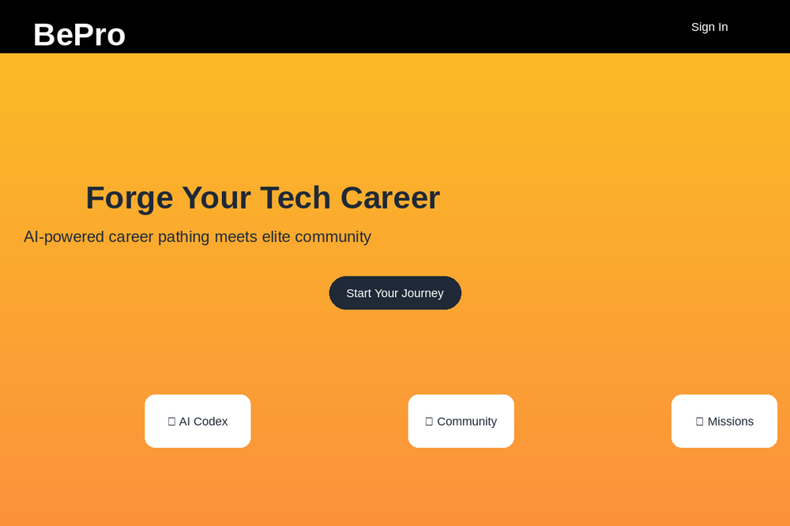
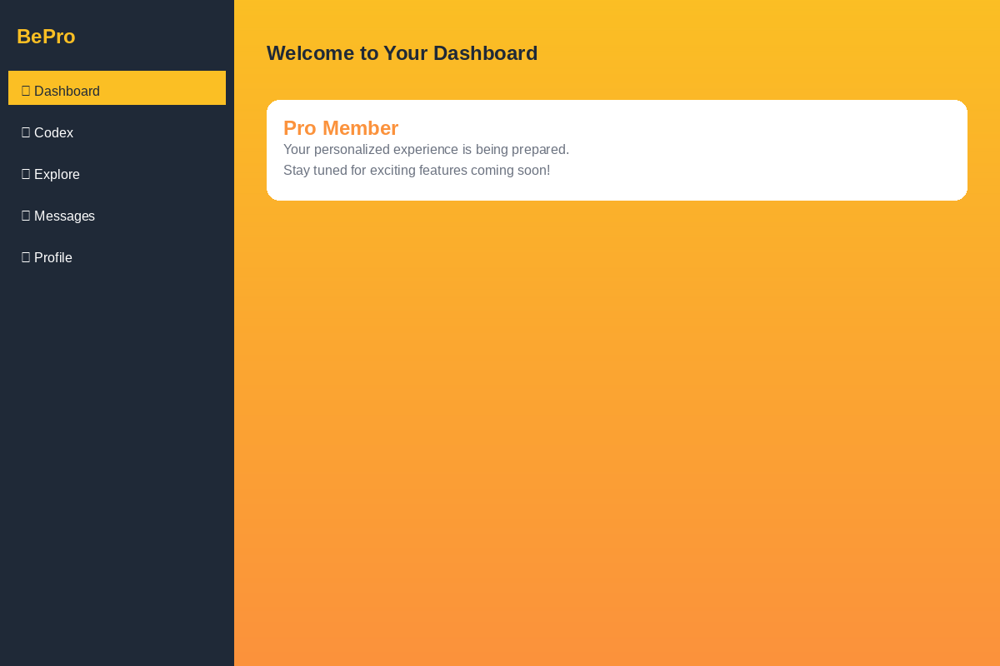
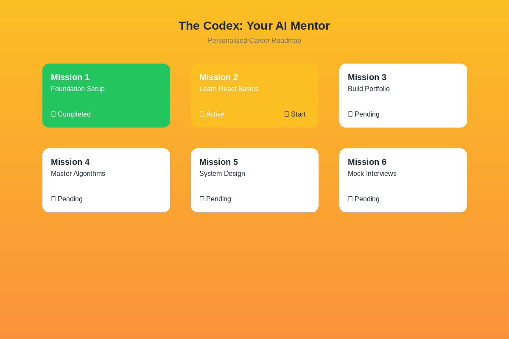
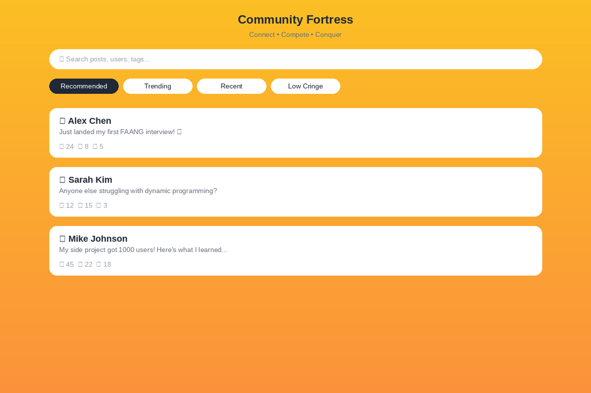
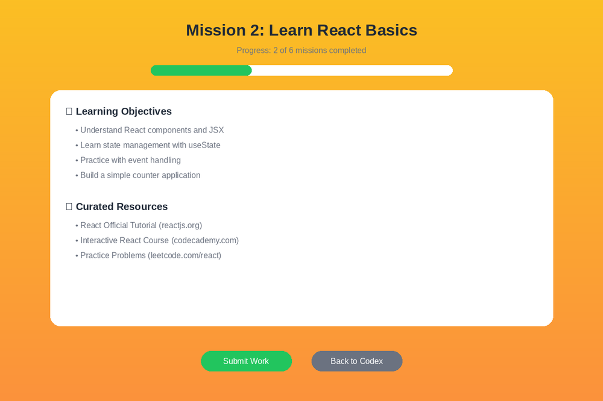
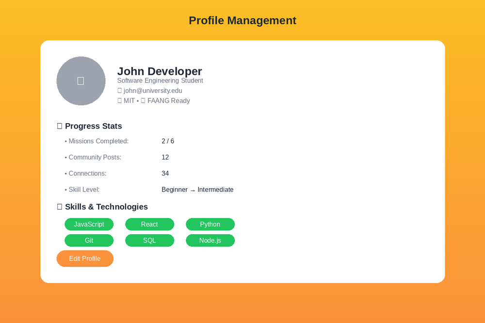

# BePro 🚀

**Forge Your Tech Career with AI-Powered Precision**

BePro is an elite platform that combines AI-powered career pathing with a high-trust community to help ambitious developers conquer their tech dreams. More than just another learning platform—it's your complete career transformation engine.

---

## 🎯 Why BePro?

> *"We are not for the casual learner; we are for the obsessed builder. We are not for the 95% who seek comfort; we are for the 5% who seek the throne."*

- **🧠 AI-Powered Roadmaps**: The Codex deconstructs elite tech roles and creates personalized, step-by-step conquest plans
- **🏰 Elite Community**: College-specific fortresses where only the most ambitious builders gather  
- **🎯 Precision Learning**: Weekly focused missions with curated resources and AI feedback
- **⚡ Real Results**: Living portfolio that showcases your growing mastery

---

## 📸 Visual Overview

### 🏠 Homepage & Landing Experience
Experience BePro's bold, gradient-rich interface designed to inspire and motivate ambitious developers.



*The BePro landing page features our signature gradient design, clear value proposition, and compelling call-to-action that sets the tone for your career transformation journey.*

---

### 📊 Dashboard Overview
Your command center for tracking progress and accessing all platform features through an intuitive sidebar navigation.



*Clean, professional dashboard with easy navigation to all major features: Codex, Explore, Messages, and Profile management.*

---

### 🧠 The Codex: AI Career Roadmaps
The heart of BePro - your personalized AI mentor that creates step-by-step roadmaps to elite tech roles.



*Interactive mission grid showing your personalized career path with clear progress tracking, active missions, and upcoming challenges.*

**Codex Features:**
- **Deconstruction**: Analyzes thousands of data points to create master blueprints
- **Prescription**: Delivers focused weekly missions with curated resources  
- **Validation**: AI mentor evaluates your work and pushes you to improve

---

### 🌐 Community Fortress
Connect with elite builders from your university. Compete, collaborate, and conquer together.



*Dynamic social feed with smart recommendations, interaction tracking, and networking opportunities within your college community.*

**Community Features:**
- **College-Specific Access**: Join your university's private fortress with verified email
- **Inter-Community Raids**: Compete against other universities in coding challenges
- **Network Building**: Find co-founders and collaborators among high-achievers

---

### 🎯 Mission Interface
Deep-dive into focused learning missions with curated resources and clear objectives.



*Immersive mission experience with progress tracking, learning objectives, curated resources, and submission workflow.*

**Mission System:**
- **Weekly Focus**: One mission at a time for maximum impact
- **Curated Resources**: Hand-picked materials for efficient learning
- **AI Feedback**: Instant evaluation and improvement suggestions

---

### 👤 Profile & Progress Tracking
Showcase your journey with a living portfolio that demonstrates your growing expertise.



*Comprehensive profile system tracking mission completion, skill development, community engagement, and career progression.*

---

## 🚀 Getting Started

### Prerequisites
- Node.js 18+ 
- npm or yarn
- Supabase account (for backend services)

### Installation

1. **Clone the repository**
   ```bash
   git clone https://github.com/narensen/BePro.git
   cd BePro
   ```

2. **Install dependencies**
   ```bash
   npm install
   ```

3. **Set up environment variables**
   ```bash
   cp .env.example .env.local
   # Add your Supabase credentials
   ```

4. **Run the development server**
   ```bash
   npm run dev
   ```

5. **Open your browser**
   Navigate to `http://localhost:3000` to see BePro in action!

---

## 🛠️ Tech Stack

- **Frontend**: Next.js 15, React 19, Tailwind CSS
- **Backend**: Supabase (Database, Auth, Real-time)
- **UI Components**: Radix UI, Lucide Icons
- **Animations**: Framer Motion
- **State Management**: Zustand
- **Real-time**: Socket.io

---

## 🏗️ Project Structure

```
BePro/
├── src/
│   ├── app/                 # Next.js App Router
│   │   ├── auth/           # Authentication pages
│   │   ├── codex/          # AI roadmap system
│   │   ├── home/           # Dashboard and explore
│   │   ├── message/        # Real-time messaging
│   │   ├── profile/        # User profiles
│   │   └── components/     # Shared components
│   └── components/         # UI component library
├── docs/                   # Documentation and images
└── public/                 # Static assets
```

---

## 🤝 Contributing

We welcome contributions from obsessed builders! Here's how to get involved:

1. **Fork the repository**
2. **Create a feature branch**: `git checkout -b feature/amazing-feature`
3. **Commit your changes**: `git commit -m 'Add amazing feature'`
4. **Push to the branch**: `git push origin feature/amazing-feature`
5. **Open a Pull Request**

### Development Guidelines
- Follow the existing code style and patterns
- Add meaningful commit messages
- Test your changes thoroughly
- Update documentation when needed

---

## 📝 License

This project is licensed under the MIT License - see the [LICENSE](LICENSE) file for details.

---

## 🌟 Community & Support

- **Discord**: Join our community of elite builders
- **Email**: hello@bepro.dev
- **Issues**: Use GitHub Issues for bug reports and feature requests

---

## ⚡ What's Next?

BePro is constantly evolving. Upcoming features include:

- **Advanced AI Mentoring**: Even more personalized feedback and guidance
- **Industry Partnerships**: Direct connections with tech companies
- **Skill Assessments**: Comprehensive testing and certification
- **Mobile App**: Take your journey on the go

---

<div align="center">

**Ready to forge your elite tech career?**

[🚀 Start Your Journey](https://bepro.live) • [📖 Documentation](docs/) • [💬 Community](https://discord.gg/bepro)

</div>
